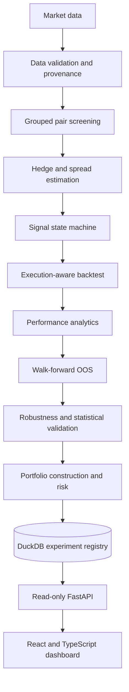

# Stat-Arb Research Platform

Causal pairs-trading research, validation and portfolio-risk infrastructure.
This project turns market data into reproducible statistical-arbitrage
experiments through a tested Python engine, immutable DuckDB records, a
read-only FastAPI service, and a React + TypeScript research dashboard. It is
research software—not a live trading bot or an investment-performance claim.

## Highlights

- Group-aware pair generation and return-correlation pre-screening.
- Engle–Granger cointegration tests with Benjamini–Hochberg FDR correction.
- Static and causal rolling OLS, plus transparent dynamic Kalman hedge estimates.
- ADF, half-life, and Hurst spread diagnostics.
- Causal spread standardisation and a stateful signal engine with explicit
  entry, exit, stop, time-exit, holding-period, and cooldown policies.
- Lagged execution with observed-price provenance, hedge-ratio-weighted pair
  units, marked-to-market accounting, commissions, slippage, borrow, financing,
  hedge rebalancing, forced liquidation, and reconciled trade ledgers.
- Formation-only walk-forward evaluation with explicit no-selection cash periods.
- Fixed-grid parameter robustness without automatic OOS winner selection.
- Moving-block bootstrap intervals, Probabilistic Sharpe Ratio (PSR), Minimum
  Track Record Length (MTRL), fold/regime diagnostics, and multiple-testing
  adjustments.
- Static multi-pair sleeve allocation, consolidated symbol exposure, and causal
  portfolio-level risk states.
- Typed immutable configuration, deterministic synthetic market fixtures,
  request-aware data caching, DuckDB persistence, and content digests.
- Read-only FastAPI endpoints and a responsive React + TypeScript dashboard.
- Broad offline automated coverage across the quantitative and application stack.

## Architecture



The Python package owns research logic. Notebooks, the API, and the frontend
orchestrate or present results; they do not duplicate the quantitative engine.

## Repository map

```text
src/pairs_trading/
├── data.py             # Provider ingestion, cleaning, provenance, synthetic data
├── stats.py            # Spreads, hedge estimation, stationarity diagnostics
├── screening.py        # Candidate generation, cointegration, FDR, ranking
├── signals.py          # Causal z-scores and stateful trade decisions
├── backtest.py         # Execution, accounting, costs, ledger, invariants
├── analytics.py        # Return, risk, drawdown, trade, rolling metrics
├── walkforward.py      # Formation/trading fold evaluation
├── robustness.py       # Predefined parameter-sensitivity scenarios
├── validation.py       # Bootstrap, PSR/MTRL, multiplicity, fold/regime evidence
├── portfolio.py        # Static sleeves and portfolio accounting
├── portfolio_risk.py   # Causal portfolio risk controls and action intents
├── pipeline.py         # Reproducible experiment orchestration and digests
├── database.py         # DuckDB persistence and immutable experiment registry
└── api.py              # Read-only FastAPI presentation layer
frontend/               # React + TypeScript dashboard and synthetic demo fixtures
tests/                  # Offline quantitative, persistence, pipeline, and API tests
notebooks/              # Colab/exploratory orchestration
reports/                # Generated research outputs
```

## Quick start

Python 3.10 or newer is required. The ordinary test suite mocks market-provider
requests and does not require internet access.

### A. Install and test the research engine

```powershell
python -m venv .venv
.venv\Scripts\python.exe -m pip install -e ".[dev]"
.venv\Scripts\python.exe -m pytest -q
```

On macOS or Linux, replace `.venv\Scripts\python.exe` with
`.venv/bin/python`.

### B. Run the full local application

Start the API from the repository root:

```powershell
.venv\Scripts\python.exe -m uvicorn pairs_trading.api:app --reload
```

The API reads `data/research.duckdb` by default. Set
`PAIRS_TRADING_DB_PATH` to a different server-controlled DuckDB file when
needed. A populated experiment registry is required to display real experiment
summaries.

In another terminal, start the dashboard:

```powershell
cd frontend
npm install
npm run dev
```

The dashboard opens at `http://localhost:5173` and uses
`http://localhost:8000` by default. Copy `frontend/.env.example` to a local
`.env` file to configure another API origin.

### C. Run the backend-free portfolio demo

PowerShell:

```powershell
cd frontend
$env:VITE_DEMO_MODE="true"
npm run dev
```

Bash:

```bash
cd frontend
VITE_DEMO_MODE=true npm run dev
```

Demo mode uses local fixed fixtures and makes no API requests. Every demo view
is visibly marked **Synthetic demo**, including the banner:
“Demo data — synthetic research output for interface demonstration.”

## Demo data versus real research

| Mode | Data source | Backend required | Interpretation |
|---|---|---:|---|
| `VITE_DEMO_MODE=true` | Two fixed TypeScript experiment fixtures | No | UI demonstration only; values are synthetic and are not investment performance. |
| `VITE_DEMO_MODE=false` | FastAPI responses loaded from DuckDB | Yes | Persisted outputs created by the Python research pipeline, subject to their recorded provenance and limitations. |

The demo uses the same frontend interfaces as the API. It includes selected
pairs, diagnostic and calendar OOS metrics, robustness/validation states,
provenance, and warnings without introducing a second response model.

## Research correctness

The implementation makes timing and availability explicit:

- pair screening and frozen fold parameters use formation data only;
- rolling estimators and z-scores are causal, with future-invariance tests;
- trade decisions execute with a later-row lag rather than same-close fills;
- forward-filled marks may value holdings but cannot authorize an entry, exit,
  rebalance, or forced liquidation;
- dynamic posterior hedge estimates cannot resize a same-row position;
- no-selection OOS periods remain zero-return cash, while unavailable calendar
  observations remain unavailable;
- predefined robustness grids diagnose sensitivity but do not automatically
  promote the best OOS scenario;
- experiment inputs, data, versions, provenance, and warnings are captured in
  canonical digests and immutable summaries;
- accounting identities, ledgers, portfolio schedules, and risk states are
  checked through focused invariant and reconciliation tests.

## Data and persistence contracts

Yahoo Finance ingestion uses explicit adjusted-price arguments and exact
request-aware cache identities. Cleaning records a cell-level observed-price
mask before limited forward fill, allowing the execution layer to distinguish
genuine observations from valuation-only marks. DuckDB stores prices, quality
reports, screening results, and canonical experiment summaries. Existing
databases without required provenance fields must be explicitly recreated or
migrated; unknown provenance is not upgraded to “observed.”

Universe eligibility must be assessed from formation-only data. Cleaning a
future-inclusive universe before a historical selection exercise can introduce
survivorship or look-ahead bias, so the pipeline keeps that limitation visible.

## Read-only API

| Endpoint | Purpose |
|---|---|
| `GET /health` | Service liveness without touching persistence |
| `GET /api/v1/meta` | Pipeline, configuration, and experiment-schema versions |
| `GET /api/v1/experiments` | Newest-first paginated experiment summaries |
| `GET /api/v1/experiments/{run_id}` | One canonical experiment summary |
| `GET /docs` | Interactive OpenAPI documentation |

The API never runs research, accepts SQL, or mutates experiments. It exposes
summary metrics and provenance, not equity curves, drawdown series, trade
ledgers, or bootstrap replicate time series.

## Testing

```powershell
.venv\Scripts\python.exe -m pytest -q
cd frontend
npm run lint
npm run build
```

Python coverage spans configuration, data quality, statistics, screening,
signals, execution and accounting, analytics, walk-forward evaluation,
robustness, validation, portfolio/risk, persistence, the research pipeline, and
the API. Frontend verification currently consists of strict TypeScript
compilation, the Vite production build, and Oxlint; no separate frontend unit
test command is configured.

## Static demo deployment

The Vite app is configured with relative production asset paths, so the demo
build can be served from a standard static host without Python or DuckDB.

PowerShell:

```powershell
cd frontend
$env:VITE_DEMO_MODE="true"
npm run build
```

Bash:

```bash
cd frontend
VITE_DEMO_MODE=true npm run build
```

Publish the generated `frontend/dist/` directory as static files. No deployment
account or paid service is required by the repository. A real-data deployment
must instead set `VITE_API_BASE_URL` at build time, deploy the FastAPI service
and DuckDB file separately, and include the public frontend origin in
`PAIRS_TRADING_CORS_ORIGINS`.

## Limitations

- This is research software, not live execution or production trading
  infrastructure.
- Dashboard demo values are fixed synthetic examples, not real backtest results.
- A caller-supplied security universe may not be point-in-time or
  survivorship-bias-free.
- Commissions, slippage, borrow, financing, fills, capacity, and market impact
  remain research approximations.
- Hedge-ratio-weighted sizing is not strictly dollar-neutral unless the hedge
  ratio equals one.
- Walk-forward folds use explicitly documented capital-reset semantics rather
  than claiming one continuous deployable capital account.
- The experiment-summary API does not persist detailed time-series artifacts,
  so the dashboard deliberately avoids fabricated performance charts.
- There is no broker integration, order management, authentication, live data,
  paper trading, or automated deployment decision.

## Project scope

The repository is intended for quantitative research, software-engineering
demonstration, and education. Historical or synthetic outputs do not imply
future profitability and are not investment advice.

<!-- Dashboard screenshots can be linked here after they are captured from the visibly labelled demo build. -->
